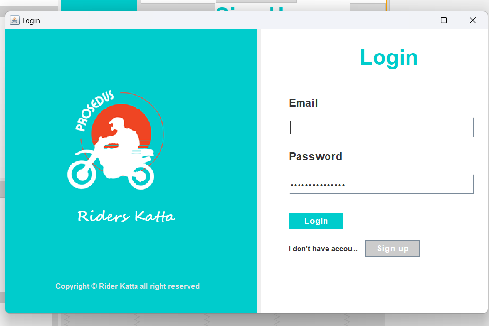
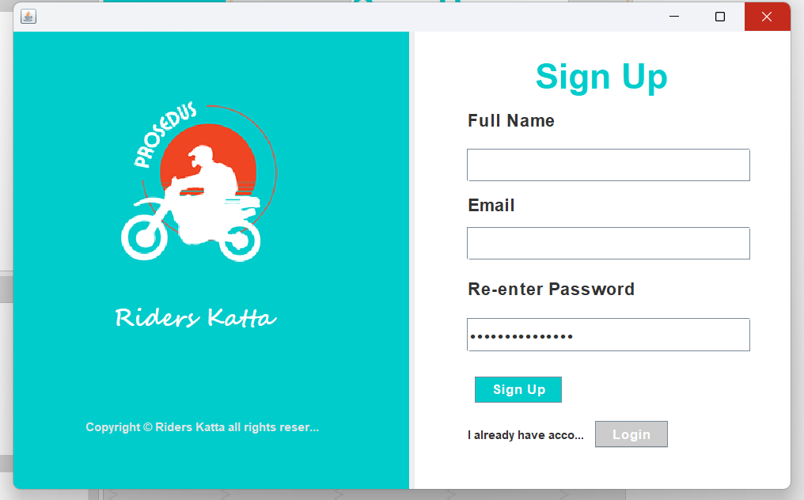

# Java Login and Registration Page using AWT

## Project Description
This project is a simple Java application that provides a graphical user interface (GUI) for user login and registration. It uses the Abstract Window Toolkit (AWT) for the GUI components.

## Features
- User login page
- User registration page

## Prerequisites
- Java Development Kit (JDK) installed (version 8 or higher)
- IDE (Integrated Development Environment) such as IntelliJ IDEA, Eclipse, or NetBeans

### Clone the Repository

git clone https://github.com/prosedus007/LoginPage_with_java.git
cd LoginPage_with_java

### Screenshots

